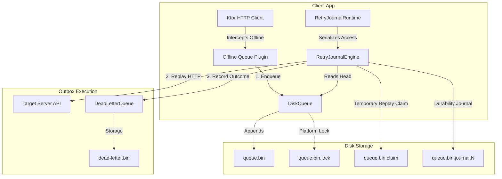

# Architecture & Reliability

`retry-journal` is designed from the ground up to guarantee that HTTP requests are never lost due to crashes, network transitions, or process lifecycles, all while maintaining a tiny, constant memory footprint.

Here is a detailed breakdown of the core architectural components and reliability guarantees.

---

## 1. Core Architecture Overview



---

## 2. Crash-Safe Storage & Byte-by-Byte Recovery

At the lowest level, `DiskQueue` stores your serialized requests in a flat, append-only binary file.

### Append-Only Log
Instead of executing in-place mutations or rewriting files (which can lead to corruption if the process is terminated mid-write), every enqueue and remove operation is an append to the queue file.
- **Enqueue**: Appends a `Live` record containing Ktor request metadata (method, URL, headers) and the request body.
- **Remove (Tombstone)**: Appends a lightweight `Tombstone` record referencing the sequence ID of the removed entry.

### CRC32 Verification
Every record written to disk is framed with a CRC32 checksum wrapping all variable-length fields (headers, URL, body). 

### Safe Resync Scan
When the app boots, `DiskQueue` performs a recovery scan. If it hits an unexpected byte pattern or a CRC mismatch (which occurs if the app was terminated in the middle of writing a record):
1. The scanner **rejects** the invalid record length.
2. Instead of trusting corrupted header length metadata to skip forward, it drops back to a safe **byte-by-byte scan** to find the next valid record boundary.
3. Any trailing invalid bytes are pruned, keeping the file healthy and preventing it from stalling.

---

## 3. Multi-Process Concurrency & Path Aliasing Protection

Because background sync workers and your main app UI can run concurrently on different threads or even different processes (e.g., WorkManager in a separate process on Android), `retry-journal` enforces strict serialization.

```
[ App UI Thread ] --------.
                          |--> [ PlatformQueueFileLock ] ---> [ Shared queue.bin.lock ]
[ OS Background Worker ] -'
```

### Platform Queue File Locks
Multi-platform file locking (`PlatformQueueFileLock`) ensures only one execution context can write to or read from the queue. On JVM and Android, this is backed by an intra-JVM reentrant lock and a cooperative OS-level file channel lock (`FileChannel.tryLock()`).

### Canonical Path Mapping
File paths can be referenced in multiple ways (e.g. symlinks, directory aliases, or case-insensitive path naming). 
If the locking mechanism keyed locks on raw path strings, two processes using different aliases for the same directory could bypass the intra-JVM locks and throw `OverlappingFileLockException`.
To prevent this, `PlatformQueueFileLock` canonicalizes paths (using `toRealPath()` on JVM and `getCanonicalPath()` on Android) before generating lock keys.

---

## 4. Highly-Optimized Memory Indexing

To support large backlogs without inflating your app's memory footprint, `DiskQueue` uses a custom `LiveEntryIndex`.

### Zero-Allocation Mapping
Typical implementations use collections like `LinkedHashMap<Long, Long>` to map sequence IDs to file offsets, which creates millions of wrapper objects, causing high memory usage and frequent garbage collection.
Instead, `LiveEntryIndex` maps sequence IDs to packed disk offsets and record lengths inside a single primitive `LongArray`:

```
Bit layout of each 64-bit Long entry in LiveEntryIndex:
 ┌───────────────────────────────────────┬────────────────────────┐
 │        offset (34 bits)               │    length (30 bits)    │
 └───────────────────────────────────────┴────────────────────────┘
```

- The **Sequence ID** is implicit in the element's position relative to the base sequence ID (index = `sequenceId - baseSequenceId`).
- The **Disk Offset** (up to 16 GiB) and **Record Length** are bit-packed into a single `Long` value.
- This results in a memory footprint of exactly **8 bytes per entry** (a ~90% reduction over standard maps).

### Span Safety
Because sequence IDs are monotonic, a single entry stuck at the head of the queue (e.g. a failing request) alongside heavy enqueue/remove activity behind it would cause the indexing array to grow indefinitely. We guard against this by enforcing a `MAX_SPAN` threshold, failing with a clear exception before the system allocates large arrays that cause an `OutOfMemoryError`.

---

## 5. Zero-Leak Delivery & Replay Claims

During network flushes, Ktor requests are sent over the wire. If a connection hangs, it is critical that we do not send duplicate requests (at-least-once / at-most-once delivery control).

### Head Replay Claims
Before replaying a request, `RetryJournalEngine` claims the head of the queue by writing a `.claim` file to disk containing the current process ID and timestamp.
* Other processes or background workers seeing this claim will skip flushing the head, preventing duplicate HTTP requests.
* Claims are renewed concurrently in the background for slow uploads.
* Safe stale checks protect against wall-clock jumps (e.g. NTP updates) to ensure claims do not lock up the queue permanently.

### Outcome Journals
To prevent state leaks if the app crashes *after* an HTTP request succeeds but *before* the record is removed from the local queue:
1. The engine writes a `.journal` file detailing the outcome (`DELIVERED` or `DEAD_LETTERED`).
2. The local queue entry is removed.
3. The `.journal` file is deleted.
If a crash occurs during step 2, the engine detects the `.journal` file upon reboot and completes the local removal instead of re-sending the request.

---

## 6. Dead Letter Retry Journals

When a request fails with a client-error status (e.g. `400 Bad Request`), it is moved to the `DeadLetterQueue` (DLQ) to prevent it from blocking the main queue.

If you choose to retry an entry from the DLQ:
- The entry is temporarily written to a `.retry.[id]` journal file.
- It is removed from DLQ storage.
- It is enqueued back into the main queue.
- The journal file is deleted.

If the process crashes during this sequence, the engine recovers the journal on startup, ensuring the request is safely restored to the main queue or dropped, preventing orphan journals from leaking.
