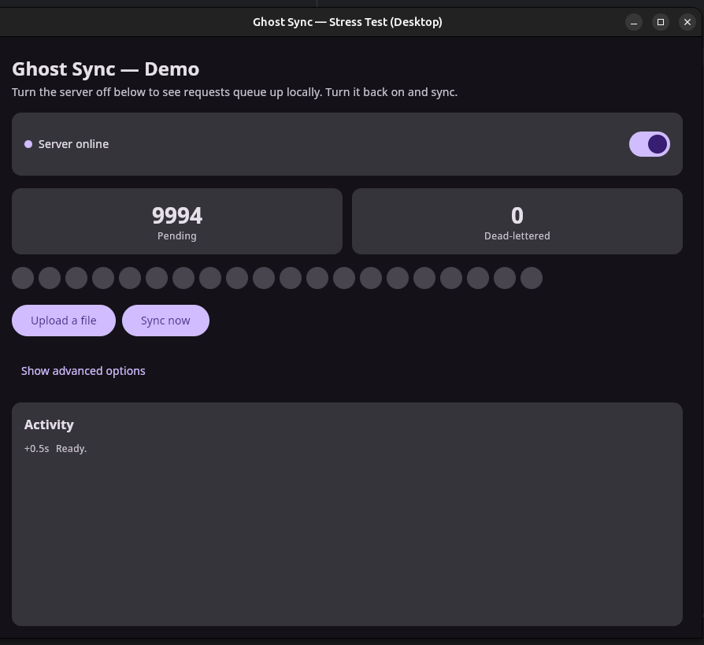

# 👻 Ghost Sync — Live Demo

**See offline-first sync in 60 seconds.** No phone required for the desktop build — server included.

This sample is a **Compose Multiplatform** app that shows exactly what your users get: requests that fail when the network is down are **saved to disk**, then **delivered when sync runs** after the network is back. Same library (`:ghost-sync`), same `flush()` contract — just with buttons and a chaos server so you can stress-test edge cases.

---

## Run it now (desktop)

```bash
./gradlew :sync-sample:composeApp:run
```

A window opens with the HTTP server **already running**. You’re ready to break the network on purpose.

---

## The story you'll tell stakeholders

> *“Watch what happens when the user loses signal mid-upload.”*

1. **Turn the server OFF** (toggle — dot goes red). That simulates zero connectivity — like airplane mode or a dead zone.
2. **Tap “Upload a file”** (or “Send 5 JSON requests”). The app tries to send, fails, and **ghost-sync writes the full request to disk**.
3. **Turn the server ON** again (dot green).
4. **Tap “Sync now”** — `runtime.flush()` replays the queue (or auto-sync runs when the server dot turns green). Watch the pending chip clear and the activity log show delivery.

That’s the product: **nothing lost**, sync when you’re back online. In production you’d call `runtime.flush()` / `runtime.flushWhenOnline()` from WorkManager or a connectivity callback — the sample also **auto-flushes** when the health poll reports online via `GhostSyncRuntime`.



---

## What each control does

| UI | What it proves |
|---|---|
| **Server On/Off** | Instant offline/online — no airplane mode needed |
| **Pending requests** | One indicator per queued HTTP call; **first chip** + Pending subtitle show `getHeadState()` (`Awaiting replay`, `finishing local removal`, `blocked`) |
| **Sync now** | Calls `runtime.flush()` — same coordinator the background worker uses |
| **Upload a file** | Multipart bytes are captured offline and replayed intact |
| **Send 5 JSON requests** | Batch mutations queue individually, replay FIFO |
| **Activity log** | Live trace: queued → delivering → delivered / dead-lettered |

---

## “Sync now” didn’t empty everything in one tap?”

**That’s intentional.** The bundled server is a **chaos server** — it rotates failure modes so you can see real engine behavior:

| Every Nth request | Behavior |
|---|---|
| 5th | Slow, then succeeds |
| 7th | `503 Service Unavailable` |
| 13th | `400 Bad Request` → **dead letter** |
| 20th | 15s stall → timeout |

When `flush()` hits a **5xx or timeout**, it **stops early** and leaves the rest on the queue — same as production on a flaky link. Tap **Sync now** again to continue.

In your shipping app, a **background worker** retries `flush()` on a timer or when `NetworkCapabilities` says you’re online — users never tap anything.

Implementation reference: [`GhostSyncWorker.kt`](composeApp/src/mobileMain/kotlin/com/ghostserializer/sync/sample/app/GhostSyncWorker.kt) (kmpworkmanager) and [`SyncSetup.kt`](composeApp/src/commonMain/kotlin/com/ghostserializer/sync/sample/app/SyncSetup.kt) (`GhostSyncRuntime` wiring).

---

## GhostSyncRuntime in this sample

[`SyncSetup`](composeApp/src/commonMain/kotlin/com/ghostserializer/sync/sample/app/SyncSetup.kt) builds:

1. `DiskQueue`, `DeadLetterQueue`, `GhostSyncEngine`, live + replay `HttpClient`s (manual wiring)
2. `GhostSyncRuntime.createForEngine(syncEngine, replayClient, …, connectivity = connectivityState)`
3. `reportConnectivity(online)` — updated by the server health poll (stand-in for `ConnectivityManager`)

On launch, `App` calls `runtime.start(autoFlushOnOnline = true)` so turning the server **on** triggers
`flushWhenOnline()` without tapping **Sync now**. The background worker uses the same `runtime`.

| Caller | API |
|--------|-----|
| **Sync now** button | `runtime.flush()` |
| Server dot → green | `reportConnectivity(true)` → auto `flushWhenOnline()` |
| kmpworkmanager worker | `runtime.flushWhenOnline()` |
| Process teardown | `runtime.stop()` (Compose dispose) / `runtime.shutdown()` on logout |

---

## Map sample → your production app

| Sample | Your app |
|---|---|
| Server toggle OFF | User in tunnel / mountain / airplane mode |
| `OfflineQueuedException` + pending chip | Toast: “Saved — will sync when online” |
| **Sync now** button | `WorkManager` / `ConnectivityManager` → `runtime.flush()` |
| Activity log | Optional debug / support screen |
| Chaos 400 | Dead letter screen → user fixes or discards |
| Desktop embedded server | Your real API base URL |

Library docs: [../README.md](../README.md).

---

## Run on Android

The server runs on your machine — not inside the APK.

```bash
# Terminal 1 — chaos server
./gradlew :sync-sample:server:run

# Terminal 2 — install app
./gradlew :sync-sample:composeApp:installDebug
```

- **Emulator:** uses `10.0.2.2` (host localhost) — works out of the box.
- **Physical device:** set your PC’s LAN IP in `PlatformServerHost.android.kt`.

Same UI flow: kill server → queue requests → start server → Sync now.

---

## Run on iOS

macOS + Xcode required for the final link step. Step-by-step: [`iosApp/README.md`](iosApp/README.md).

---

## Module map

| Module | Role |
|---|---|
| `:ghost-sync` | The library (Maven artifact) |
| `:sync-sample:shared` | Shared ViewModel + sync wiring |
| `:sync-sample:composeApp` | Compose UI + desktop/Android/iOS shells |
| `:sync-sample:server` | Chaos HTTP server for demos |

---

## Build status

| Target | Status |
|---|---|
| `shared` (JVM + Android) | ✅ Compiles |
| `server` | ✅ Chaos rotation verified |
| `composeApp` Desktop | ✅ `./gradlew :sync-sample:composeApp:run` |
| `composeApp` Android | ✅ Debug APK |
| `composeApp` iOS | ⏭️ Needs macOS |
| `iosApp/` | Swift scaffold — see iosApp README |

---

## Next step

Clone → run desktop demo → flip server off → upload → flip on → sync. Then copy the **Worker + `flush()` on connectivity** pattern into your app. Questions about API details: [main README](../README.md).
